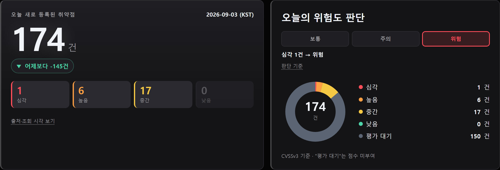
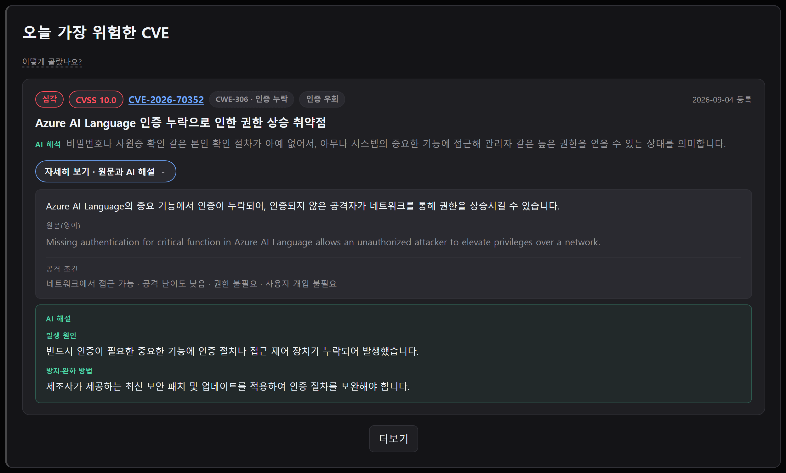
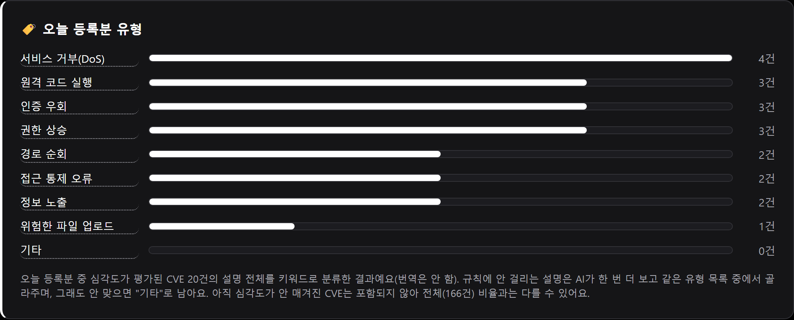
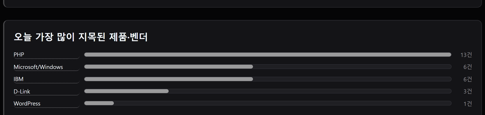
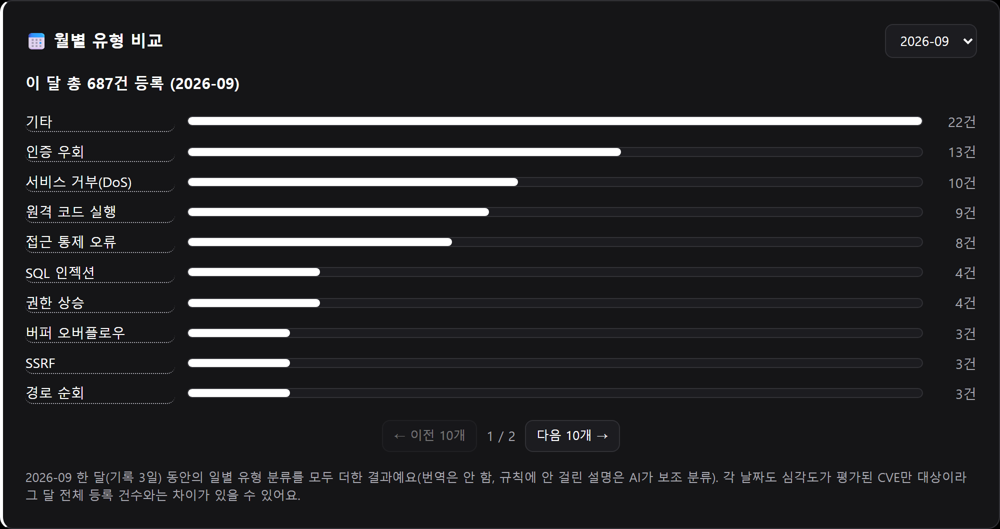
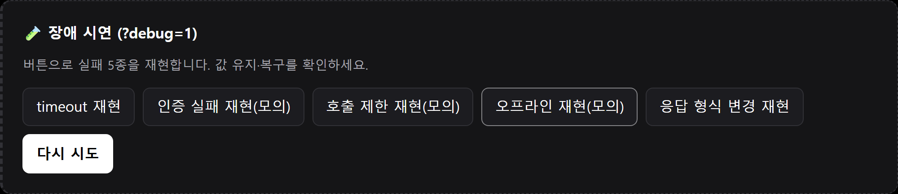
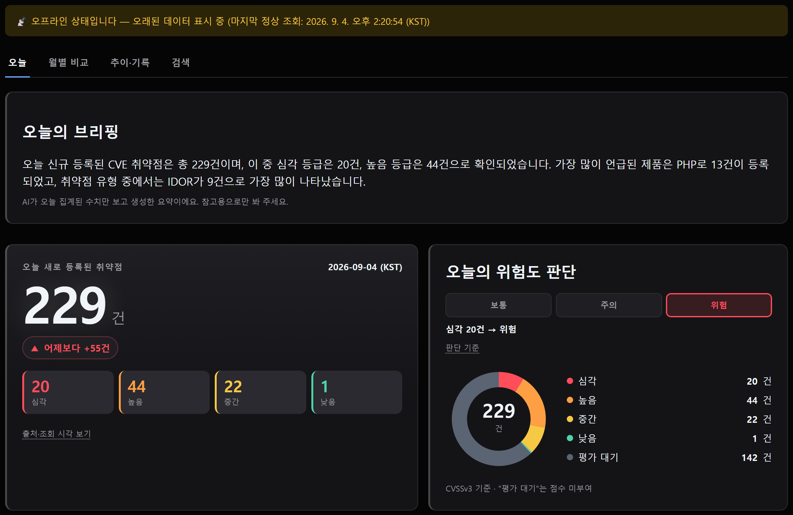

# 🛡️ 오늘의 CVE 정보판

오늘(KST) 새로 등록된 [NVD](https://nvd.nist.gov/) CVE(보안 취약점)를 **건수 · 심각도 · 위험도 · 대표 사례 · 유형/제품별 분포 · 추이**까지 한 화면에서 보여주는 개인 정보판입니다. 서버·로그인·설치 없이 브라우저로 바로 열립니다.

**🔗 공개 주소: https://whiteclover0542.github.io/Today_CVE_information/**



## 한눈에 보는 흐름

```
GitHub Actions(매일 09:00 KST)
    → NVD에서 오늘 등록된 CVE 조회
    → 심각도·유형·제품 집계, "기타"만 AI로 보조 재분류
    → data/history.json 에 기록 추가·커밋
    → GitHub Pages가 그 파일을 읽어 대시보드에 렌더링
```

즉 **매일 자동으로 쌓이는 기록**을 **정적 페이지가 그대로 읽어서 보여주는** 구조이며, 아래 "동작 방식"에서 더 자세히 다룹니다.

## 주요 기능

### 1. 오늘 건수 + 심각도/위험도

값·단위·출처·조회 시각을 한 카드에서 보여주고, 옆 카드에서 CVSSv3 심각도(심각·높음·중간·낮음) 분포를 도넛 차트로, 그 분포로 계산한 **보통/주의/위험** 3단계 위험도를 판단 기준과 함께 표시합니다(심각 1건 이상=위험 · 높음 1건 이상=주의 · 그 외=보통). 출처 링크를 누르면 실제 호출한 NVD API 원자료가 그대로 열립니다.

### 2. 오늘의 대표 CVE

오늘 등록분 중 대표 CVE를 CVSS 점수·유형 태그·공격 조건(네트워크/로컬 접근, 난이도, 권한, 사용자 개입 필요 여부)·한국어 설명과 함께 보여줍니다.



### 3. 오늘 등록분 유형 분류

심각도가 평가된 CVE 전체의 설명을 키워드 규칙(원격 코드 실행·인증 우회·SQL 인젝션 등)으로 분류해 막대 그래프로 보여줍니다. 규칙에 안 걸려 "기타"로 남는 설명만 **Gemini API 무료 티어로 한 번 더** 재분류합니다(같은 유형 목록 안에서만 고르도록 강제). 번역 API는 이 분류 과정에 쓰지 않습니다.



### 4. 오늘 등록분 제품·벤더

설명 문구에서 미리 정해둔 벤더·제품 목록에 확실히 걸리는 것만 집계합니다(AI 미사용, 목록에 없으면 표시 안 함). 막대를 누르면 해당 벤더가 언급된 원본 CVE 링크가 펼쳐집니다.



### 5. 월별 유형·제품 비교

월 선택 드롭다운으로 과거 달까지 거슬러 올라가, 그 달에 쌓인 기록을 유형별·제품별로 합산해 비교할 수 있습니다.



### 6. 어제 대비 비교 + 최근 추이

이전 기록과의 차이·방향·단위를 보여주되, 두 기록의 조회 시각이 다르면(측정 구간 차이) 그 사실도 함께 노출해 오해를 방지합니다. 그 아래에는 최근 기록의 일평균/최고/최저와 막대 그래프, 날짜별 전체 기록 표가 이어집니다.

### 7. 장애 5종 시연 (`?debug=1`)

timeout · 인증 실패 · 호출 제한 · 오프라인 · 응답 형식 변경을 각각 버튼으로 재현하고, 실패 중에도 마지막 정상값을 유지하며 "다시 시도"로 복구됩니다.




### 8. 비밀값 없는 배포

배포되는 정적 파일(HTML/CSS/JS)과 브라우저 쪽 호출은 API 키 없이 쓸 수 있는 공개 엔드포인트만 사용합니다. Gemini 재분류는 **배포 후 프론트엔드가 아니라, 매일 실행되는 서버 쪽 배치 스크립트에서만** 저장소 시크릿(`GEMINI_API_KEY`)으로 호출되므로 브라우저·배포 파일·Git 기록 어디에도 키가 노출되지 않습니다.

## 동작 방식

```
[GitHub Actions: 매일 00:00 UTC(=09:00 KST) 실행, workflow_dispatch로 수동 실행도 가능]
        │  scripts/fetch-daily-count.mjs 실행
        │  1) NVD CVE API 2.0 호출 (키 없이, 오늘 KST 00:00~실행 시각 범위)
        │  2) 심각도별 CVSS·설명을 모아 규칙 기반으로 유형·제품/벤더 집계
        │  3) 규칙에 안 걸린 "기타" 설명만 Gemini API(시크릿 GEMINI_API_KEY)로 재분류
        │  4) 대표 CVE 설명을 MyMemory Translation API로 한국어 번역(실패 시 영문 유지)
        ▼
  data/history.json 에 건수·심각도 분포·유형/제품 집계·대표 CVE(CVSS 포함) 추가
  (같은 날짜 기록이 이미 있으면 건너뜀 → 하루 1건, 중복 방지)
        │  git commit & push
        ▼
[GitHub Pages: index.html + assets/app.js]
        │  같은 저장소의 data/history.json을 fetch (동일 출처, 서버 불필요)
        ▼
  브라우저에서 값·출처·심각도·위험도·CVSS·유형/제품 분포·월별 비교·추이·비교를 렌더링
```

서버리스 프록시 없이 **정적 사이트 + 하루 1회 배치**로만 구성되어 있습니다. NVD API는 키 없이도 30초당 5회까지 호출할 수 있어(하루 1회 호출이면 충분), 브라우저에서 필요한 값에는 비밀값을 아예 만들지 않는 쪽을 택했습니다. Gemini 키는 배치 실행 환경(GitHub Actions)에만 존재합니다.

## 기술 스택

- 프론트엔드: 순수 HTML/CSS/JavaScript (프레임워크 없음)
- 배치: Node.js 20, GitHub Actions (`schedule` cron + `workflow_dispatch`)
- 데이터 출처: [NVD CVE API 2.0](https://nvd.nist.gov/developers/vulnerabilities) (무키)
- 번역: [MyMemory Translation API](https://mymemory.translated.net/) (대표 CVE 설명 한국어 번역, 실패해도 영문으로 대체)
- 보조 분류: Gemini API 무료 티어 (규칙에 안 걸린 "기타" 유형만, 배치 환경 시크릿으로만 호출)
- 배포: GitHub Pages

## 프로젝트 구조

```
index.html                      # 정보판 화면
assets/
├── app.js                      # fetch·렌더링·장애 시뮬레이터·비교/위험도/월별 집계 계산
└── style.css
data/
└── history.json                # 날짜별(KST) 기록 — Actions가 추가, 앱은 읽기 전용
scripts/
└── fetch-daily-count.mjs       # NVD 조회 → 분류/번역 → history.json 갱신 스크립트
.github/workflows/
└── daily-cve-count.yml         # 매일 09:00 KST 실행 배치
docs/
└── screenshots/                # 이 README에 쓰인 스크린샷
assignment/                     # 과제 제출 관련 자료 (실 서비스 문서와 분리)
├── ASSIGNMENT.md              # 과제 원문 (동결)
├── PROGRESS.md                # 진행 상황·설계 결정 이력
├── SUBMISSION.md / .pdf       # 최종 제출 문서
└── worksheet/                  # 정의표·장애 검사표·손계산 대조표 등 근거 자료
```

## 문서

- [`assignment/SUBMISSION.md`](assignment/SUBMISSION.md) — 목적·정의, 과제 카드 5개, 검증 안내서, AI 3줄, 체크리스트, 스크린샷을 담은 최종 제출 문서
- [`assignment/PROGRESS.md`](assignment/PROGRESS.md) — 진행 상황과 설계 결정 이력
- [`assignment/worksheet/`](assignment/worksheet/) — 정의표·장애 5종 검사표·손계산 대조표 등 근거 자료
