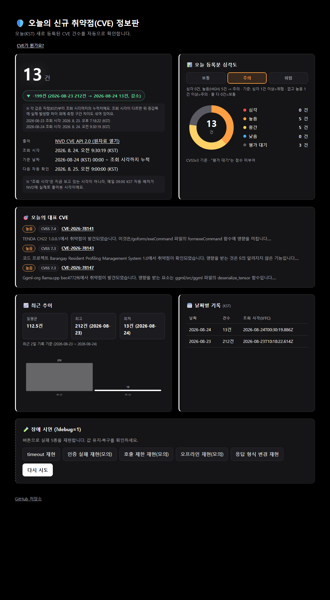
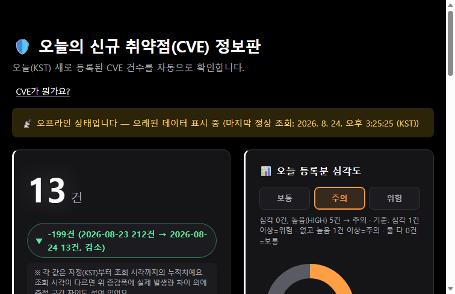

# 오늘의 CVE 정보판 — 최종 제출 문서

- **공개 주소**: https://whiteclover0542.github.io/Today_CVE_information/
- **저장소**: https://github.com/whiteclover0542/Today_CVE_information
- **최종 확인일**: 2026-08-24 (KST)
- **주제**: 오늘(KST) 새로 등록된 NVD CVE 건수 — 값·단위·출처·조회 시각 + 심각도·CVSS·위험도·날짜별 변화

---

## 1. 목적

> 이 정보판은 오늘 새로 등록된 보안 취약점(CVE) 수를 확인하기 위한 것이다.

| 항목 | 정의 |
| --- | --- |
| 출처 | NVD(미국 국립취약점데이터베이스) CVE API 2.0 — `https://services.nvd.nist.gov/rest/json/cves/2.0` |
| 표시 항목 | 응답의 `totalResults` (질의 조건에 맞는 CVE 총 건수) |
| 단위 | 건 |
| 기준 시간대 | Asia/Seoul (KST, UTC+9) |
| 집계 범위 | 해당 KST 날짜 00:00:00부터 조회(배치 실행) 시각까지 신규 등록된 CVE |
| 갱신 주기 | 1일 1회, GitHub Actions cron `0 0 * * *`(UTC) = 매일 09:00 KST |

정의·대조 근거의 상세 기록은 [`worksheet/definitions.md`](worksheet/definitions.md) 참고.

---

## 2. 과제 카드 5개

| # | 카드 | 하는 일 | 통과 기준 | 상태 |
| --- | --- | --- | --- | --- |
| 1 | 값의 맥락 | NVD에서 오늘(KST) 신규 등록 CVE 건수를 가져와 값·단위·출처·조회 시각을 한 화면에 표시 | 현재값·단위·출처·조회 시각이 한 화면에 보인다 | ✅ |
| 2 | 비밀키와 호출 경로 | 무키 경로로 NVD를 호출하고, 출처 주소를 화면에 노출해 클릭 시 원자료가 열리게 한다 | 출처 주소가 화면에 보이고 클릭하면 원자료 페이지가 열린다 | ✅ |
| 3 | 실패를 구분해 보여주기 | timeout·인증 실패·호출 제한·오프라인·응답 형식 변경 5종을 각각 재현하고 서로 다르게 표시 | 현재 자료인지 오래된 자료인지 상태 문구로 구분된다 | ✅ |
| 4 | 하루 한 번 기록 | 기준 시간대(Asia/Seoul)를 명시하고 날짜별 값 하나만 저장, 같은 날 중복 방지 | 날짜별 값이 같은 날짜 중복 없이 목록에 보인다 | ✅ |
| 5 | 어제와 비교 검증 | 두 날짜의 원자료·저장값·계산값·화면값을 대조하고 어제 대비 변화를 표시 | 이전 값과 현재 값의 차이·방향·단위가 한 화면에 보인다 | ✅ |

카드별 근거 자료: [`worksheet/definitions.md`](worksheet/definitions.md) (카드1) · [`worksheet/failure-matrix.md`](worksheet/failure-matrix.md) (카드3) · [`worksheet/comparison-table.md`](worksheet/comparison-table.md) (카드5).

---

## 3. 검증 안내서 (최종 제출물)

**어디로 가나요**
`https://whiteclover0542.github.io/Today_CVE_information/` — 설치 없이 브라우저로 바로 열립니다.

**무엇을 하나요** (3단계)
1. 공개 주소 접속 → 건수·단위·출처·조회 시각·심각도·위험도가 한 화면에 보이는지 확인
2. 출처 링크 클릭 → NVD 응답의 `totalResults`가 화면 숫자와 같은지 확인
3. `?debug=1`로 재접속 → 장애 버튼 아무거나 클릭해 문구만 바뀌고 값은 유지되는지, "다시 시도"로 복구되는지 확인

**무엇이 보이면 통과인가요**
- 건수·단위·출처·조회 시각이 스크롤 없이 한 화면에 보인다
- 출처 링크의 NVD 응답 값이 화면 숫자와 같다
- 날짜별 기록 2건 이상이 중복 없이 쌓여 있고, 최신 두 날짜의 차이가 보인다
- 오늘 등록분 심각도에 "보통/주의/위험" 3단계 중 오늘 해당하는 칸이 강조돼 있고, 그 판단 기준이 캡션에 그대로 보인다
- 대표 CVE 목록에 CVSS 점수 배지가 붙어 있다 (수집 이전 과거 기록은 배지 없이 표시 — 위조하지 않음)
- 장애 버튼 5개가 서로 다른 문구를 보이고, 실패 중에도 값이 유지되며, "다시 시도"로 복구된다

**안 될 때**
- 값이 `—`면 데이터를 못 가져온 상태를 그대로 보여주는 것(위조 안 함) — 반복되면 Actions 실행 로그 확인
- 장애 버튼이 안 보이면 `?debug=1`이 정확히 붙었는지 확인
- 비교 카드 증감폭이 커 보이면 그 아래 조회 시각 목록에서 이유(측정 구간 차이) 확인 가능 — [`worksheet/comparison-table.md`](worksheet/comparison-table.md) 참고

---

## 4. AI 3줄

- **AI에게 맡긴 일**: 아키텍처 설계부터 프론트엔드·워크플로 구현, 버그 수정, CVSS 점수·위험도 판정 기능 추가, 검증 문서화까지 코드 작업 전반
- **내가 판단한 일**: 데이터 주제·아키텍처 확정, 화면이 "보기 어렵다"는 재작업 지시, 어제·오늘 건수 차이(212→13건)가 이상하다고 질문해 측정 구간 불일치를 직접 밝혀냄, CVSS·위험도 추가 방향과 시각화 재작업 지시
- **AI 말을 안 들은 일**: 처음 제시한 예시성 데이터(날씨·환율 등) 대신 보안 테마로 다시 고르게 함

---

## 5. 마무리 체크리스트

| # | 항목 | 판단 | 증거 |
| --- | --- | --- | --- |
| 1 | 현재값·단위·출처·조회 시각이 한 화면에 보인다 | 공개 주소 첫 화면에서 4가지가 스크롤 없이 확인됨 | 배포된 화면 스크린샷 (§6) |
| 2 | 화면값이 원자료의 같은 항목·단위·기준 시각과 일치한다 | NVD API 응답의 `totalResults`와 화면 숫자가 같은 시각 기준으로 일치 | [`worksheet/definitions.md`](worksheet/definitions.md) 대조 기록 |
| 3 | 브라우저·배포 파일·네트워크 주소·Git 기록에 비밀값이 0건이다 | devtools 소스/네트워크, 정적 파일 전체, `git log -p` 전체 검색 결과 0건 | 검색 결과 로그 |
| 4 | 장애 5종이 구분되고 마지막 정상값·오래된 데이터 표시가 작동한다 | 5개 버튼 각각 다른 문구, 실패 중에도 마지막 정상값 유지, "오래된 데이터" 배지 표시 | [`worksheet/failure-matrix.md`](worksheet/failure-matrix.md), 오프라인 상태 스크린샷 (§6) |
| 5 | 정상값이 없을 때 값이 있는 것처럼 표시하지 않는다 | 첫 로드 실패 시 빈 상태로 표시, 위조된 숫자 없음 | 빈 상태 확인 기록 ([`worksheet/failure-matrix.md`](worksheet/failure-matrix.md)) |
| 6 | 서로 다른 실제 날짜 기록 2건이 있고 같은 날 중복이 없다 | `history.json`에 날짜 키가 서로 다른 2개, 같은 날 재실행해도 1건 유지 | `data/history.json`, 워크플로 실행 로그 |
| 7 | 기다린 기간과 능동 작업시간을 분리했다 | 대기 시간(자정 넘기기)과 실제 작업 시간이 구분되어 기록됨 | `PROGRESS.md` 진행 상태 갱신 이력 |
| 8 | 원자료·저장값·계산값·화면값을 손계산으로 재검산했다 | 두 날짜분 대조표에서 손계산 결과와 화면 결과가 일치 | [`worksheet/comparison-table.md`](worksheet/comparison-table.md) |
| 9 | 공개 화면·파일·제출 기록에 개인정보와 비밀값이 0건이다 | 커밋 전 점검 체크리스트 통과 | `PROGRESS.md` "항상 지킬 것" |
| 10 | 검증 안내서가 3단계 이내, 30초 안에 끝난다 | 어디로/무엇을/통과기준/안될때 4항목 모두 작성, 행동 3단계 이하 | 본 문서 §3 |
| 11 | AI 3줄이 작성되었다 | 맡긴 일·판단한 일·안 들은 일 각 1줄 | 본 문서 §4 |

---

## 6. 스크린샷 증거

### 정상 상태 (전체 화면)
값·단위·출처·조회 시각, 어제 대비 비교, 오늘 등록분 심각도·위험도 3단계, 대표 CVE(CVSS 포함), 최근 추이, 날짜별 기록, 장애 시연 패널(`?debug=1`)까지 한 페이지에서 확인.

### 장애 재현 — 오프라인 상태
"다시 시도" 전까지 마지막 정상값(13건)이 유지되고, 배너가 "오프라인 상태입니다 — 오래된 데이터 표시 중 (마지막 정상 조회: …)"로 바뀌는 것을 확인.

나머지 4종(timeout·인증 실패·호출 제한·응답 형식 변경) 재현 결과는 [`worksheet/failure-matrix.md`](worksheet/failure-matrix.md)에 문구·처리 방식이 표로 기록되어 있음.

---

## 7. 근거 자료 목록

| 자료 | 위치 |
| --- | --- |
| 정의표 (카드1) | [`worksheet/definitions.md`](worksheet/definitions.md) |
| 장애 5종 검사표 (카드3) | [`worksheet/failure-matrix.md`](worksheet/failure-matrix.md) |
| 손계산 대조표 (카드5) | [`worksheet/comparison-table.md`](worksheet/comparison-table.md) |
| 진행 관리·설계 결정 이력 | [`PROGRESS.md`](PROGRESS.md) |
| 과제 원문 (동결) | [`ASSIGNMENT.md`](ASSIGNMENT.md) |
