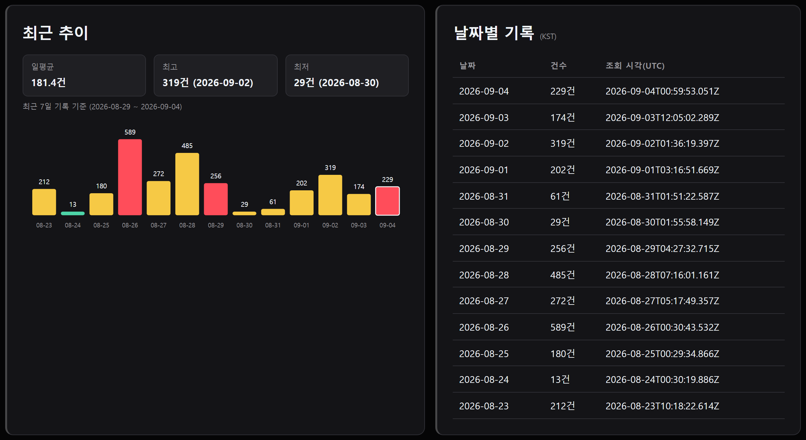
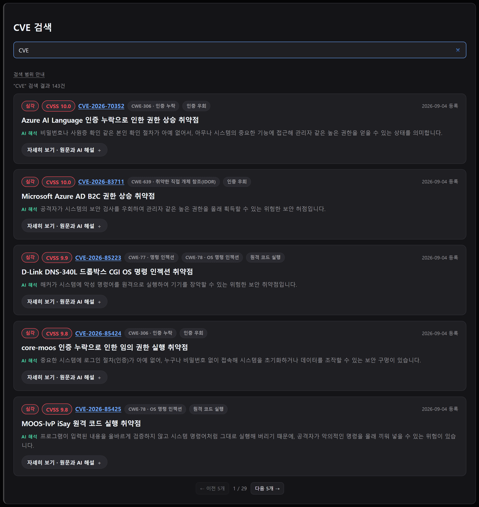

# 오늘의 CVE 정보판 (TODAY CVE)

NVD가 매일 새로 등록하는 보안 취약점(CVE)을 자동으로 모아 **몇 건이고, 얼마나 위험하고, 무엇이 문제인지**를 한 화면에서 보여주는 정적 대시보드입니다. 심각한 CVE는 AI가 한국어로 번역·해설하고, 그 AI 출력의 품질은 별도의 평가 프레임워크로 정량 검증합니다.

**🔗**: https://today-cve-information.vercel.app/ — 설치·로그인 없이 바로 열립니다.

**💻 소스코드**: https://github.com/whiteclover0542/Today_CVE_information

---

## 한눈에 보기

- **매일 자동 갱신** — 사람 개입 없이 매일 09:00 KST에 NVD 신규 등록분을 수집·집계·배포
- **AI가 번역만 하지 않고 해설까지** — 대표 CVE마다 한국어 요약·해석·발생 원인·방지법을 한 번의 LLM 호출로 생성
- **AI 품질을 말로만 하지 않고 수치로 증명** — 자체 G-Eval 평가 프레임워크로 분류 정확도·번역 정확도·환각(지어내기) 여부를 정기적으로 측정([평가 결과](#ai-품질-평가-결과))
- **서버 비용 0원** — 정적 사이트 + 무키 공개 API + LLM 무료 티어만으로 운영
- **장애에도 값을 지킨다** — API 실패 시 마지막 정상값을 유지하며 "오래된 데이터" 배너로 투명하게 알림

---

## 스크린샷

### 오늘 — 브리핑과 위험도 판단
그날 집계된 수치만 근거로 AI가 1~3문장 브리핑을 쓰고, 바로 아래에 오늘 신규 건수와 심각도 분포로 판단한 위험도(보통/주의/위험)를 보여줍니다.


### 오늘 — 가장 위험한 CVE
CVSS 순으로 정렬된 대표 CVE 카드. 제목과 한 줄 해석만 먼저 보이고, 펼치면 원문·번역·발생 원인·방지법까지 나옵니다(AI 생성 부분은 초록색으로 구분).


### 오늘 — 취약점 유형·제품 집계
"CWE 분포" 같은 분류명 대신 결론을 제목으로 답니다. 막대를 누르면 그 유형의 실제 CVE와 해설이 그대로 펼쳐집니다.


### 월별 비교
지난 달들과 유형·제품 순위를 겹쳐 볼 수 있습니다.


### 추이·기록
최근 14일 흐름과 날짜별 전체 기록입니다.



### 검색
지금까지 화면에 불러온 CVE를 번호·제품명·CWE·키워드로 바로 찾을 수 있습니다.



### 장애 대응
`?debug=1`로 timeout·인증 실패·호출 제한·오프라인·응답 형식 변경 5종의 실패를 직접 재현해, 값이 유지되고 배너로 상태가 안내되는지 확인할 수 있습니다.


---

## 아키텍처

### 인프라 흐름

```
Cloudflare Cron Trigger (매일 09:00 KST 정각)
  └ GitHub API로 workflow_dispatch 호출
        ↓
GitHub Actions
  └ NVD CVE API 2.0 조회 (오늘 00:00 KST ~ 실행 시각)
  └ 심각도·CWE 유형·제품 집계
  └ 중요 CVE는 Gemini로 번역 + 해석 + 발생 원인 + 방지법 생성, 오늘의 브리핑도 함께 생성
  └ data/history.json 에 하루 1건 추가 → commit & push
        ↓
Vercel (GitHub 연동, push마다 자동 재배포)
  └ 같은 저장소의 history.json 을 fetch 해서 렌더링
```

GitHub Actions의 `schedule` cron은 정시(0분)에 부하가 몰려 실행 시각이 매일 들쭉날쭉해지는 문제가 있어, 실행 시각만 Cloudflare Cron Trigger가 정확히 맞춰 트리거하고 실제 작업은 GitHub Actions가 그대로 수행합니다. 서버리스 프록시 없이 **정적 사이트 + 하루 1회 배치**로만 굴러갑니다.

### AI 파이프라인과 품질 검문소

모델을 직접 재학습하는 대신, **각 LLM 호출의 출력물을 독립된 방식으로 채점**하는 구조를 택했습니다.

```
NVD 신규 CVE 등록
        │
        ▼
   fetch-daily-count.mjs (배치)
        │
        ├─ 유형 태그(규칙 → '기타'만 LLM 재분류)    ──► 검문소 A: CWE 기반 골든셋 대조      → 분류 정확도·F1
        ├─ 번역·해설(요약/해석/원인/방지법)          ──► 검문소 B: G-Eval(독립 세션 심사)     → 지어내지 않음·번역정확도·근거성·자연스러움
        ├─ 오늘의 브리핑(1~3문장 요약)               ──► 검문소 C: G-Eval(독립 세션 심사)     → 무결성·관련성·자연스러움
        │                                              검문소 D: calibration(good/bad 대조) → 심사 자체의 신뢰도 검증
        ▼
   data/history.json → index.html (사용자 화면)
```

분류는 정답이 있는 닫힌 문제라 NVD 공식 CWE로 만든 골든셋과 직접 대조하고, 번역·해설·브리핑은 정답 문장이 없는 열린 텍스트라 이 프로젝트가 가장 중시하는 **"지어내지 않는다"** 원칙을 기준으로 G-Eval이 채점합니다. 심사 모델은 Gemini 자기 채점(할당량 문제·자기 편향 우려)을 폐기하고, 완전히 다른 제공사·모델인 **Claude가 별도의 새 세션에서 API 호출 없이 직접 채점**하는 방식으로 정착했습니다.

---

## AI 품질 평가 결과

> 전체 방법론·사례 분석은 [`AI_EVAL_REPORT.md`](AI_EVAL_REPORT.md)에, 도구 사용법은 [`scripts/eval/README.md`](../scripts/eval/README.md)에 있습니다. ✅ 목표 달성 · 🟡 근소 미달

| 영역 | 지표(만점 5.0) | 목표 | 결과(개선 전 → 후) |
| --- | --- | --- | --- |
| 분류(카테고리) | Accuracy(전체 46건) | ≥ 0.70 | 0.61 → **0.76** ✅ |
| 분류(카테고리) | Macro-F1(전체) | ≥ 0.70 | 0.77 → **0.87** ✅ |
| 번역·해설 생성 | faithfulness(지어내지 않음) | ≥ 4.0 | 4.90 → **5.00** ✅ |
| 번역·해설 생성 | translationAccuracy | ≥ 4.0 | 4.90 → **4.95** ✅ |
| 번역·해설 생성 | groundedCause(원인의 근거성) | ≥ 4.0 | 4.65 → **5.00** ✅ |
| 번역·해설 생성 | koreanFluency | ≥ 4.0 | 4.90 → **4.85** ✅ |
| 오늘의 브리핑 | noFabrication(무결성) | ≥ 4.0 | 5.00 → **5.00** ✅ |
| 오늘의 브리핑 | relevance | ≥ 4.0 | 5.00 → **4.75** ✅ |
| 오늘의 브리핑 | koreanFluency | ≥ 4.0 | 4.00 → **5.00** ✅ |
| 심사 자체 신뢰도 | bad/good 판별력(격차) | ≥ 3.0점 | **4.0점** ✅ (bad 1.0 / good 5.0, 개선 전후 동일) |
| 데이터 커버리지 | 대표 CVE 해설 생성 성공률 | ≥ 90% | **88.2%** 🟡 |

핵심 성과: 1차 평가에서 발견한 약점 3가지를 실제로 고치고 재측정까지 마쳤습니다 — ① 분류 규칙 배열 순서 문제를 고쳐 accuracy 0.61→**0.76**, ② "CWE 근거가 있으면 원인을 반드시 채워라"는 지시를 추가해 groundedCause 4.65→**5.00**, ③ 브리핑 조사(助詞) 사용 규칙을 명확히 해 koreanFluency 4.00→**5.00**. 덤으로 API 429(요청 한도 초과) 재시도 로직이 서버가 요구하는 대기시간보다 짧게 기다려 재시도가 무의미했던 버그도 찾아 고쳤습니다. 남은 과제는 위조가 아니라 카테고리 경계·어순 같은 다듬기 수준의 결함뿐입니다.

---

## 설계 원칙

- **지어내지 않는다** — AI 해설은 NVD 공식 CWE 분류를 근거로만 생성하고, 근거가 없으면 그 항목을 아예 비웁니다. CWE가 없는 CVE는 해설 없이 목록으로만 보여줍니다.
- **비밀값을 만들지 않는다** — 브라우저가 쓰는 건 전부 무키 공개 데이터입니다. Gemini 키는 배치 환경(GitHub Actions 시크릿)에만 있고 배포 파일·Git 기록 어디에도 없습니다.
- **실패해도 값은 남긴다** — 조회에 실패하면 마지막 정상값을 유지한 채 "오래된 데이터"임을 배너로 알립니다. `?debug=1`로 실패 5종을 직접 재현해 검증할 수 있습니다.
- **품질을 주장이 아니라 측정으로 증명한다** — AI 출력을 자체 평가 프레임워크로 정기 채점하고, 그 결과와 방법론을 문서로 공개합니다.

---

## 기술 스택

순수 HTML/CSS/JS(프레임워크 없음) · Node.js 20 배치 · GitHub Actions · Vercel · Cloudflare Workers(Cron Trigger)
· [NVD CVE API 2.0](https://nvd.nist.gov/developers/vulnerabilities)(무키) · Gemini API(번역·해설·브리핑, 무료 티어)
· 자체 G-Eval 평가 프레임워크(`scripts/eval/`) — Claude 독립 세션 채점

---

## 더 알아보기

- [`../README.md`](../README.md) — 리포지토리 기본 안내
- [`PLAN.md`](PLAN.md) — 서비스 기획서
- [`PROGRESS.md`](PROGRESS.md) — 진행 상황과 설계 결정 이력
- [`AI_EVAL_REPORT.md`](AI_EVAL_REPORT.md) — AI 품질 평가 전체 리포트
- [`../scripts/eval/README.md`](../scripts/eval/README.md) — 평가 프레임워크 사용법
